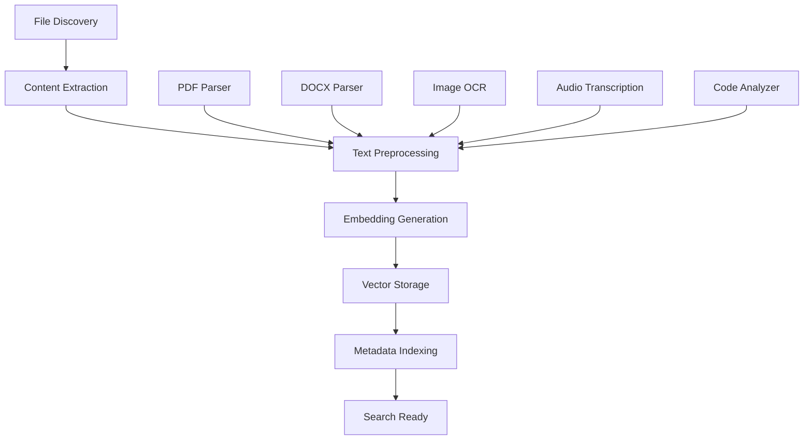

# Grahmos AI Search MVP - BMAD Strategic Plan

## 🎯 Executive Summary

Transform the existing UI framework into a fully functional AI-powered offline search MVP that can intelligently index, search, and retrieve content without internet connectivity. This plan outlines the complete agent ecosystem, MCP integrations, and technical infrastructure needed.

---

## 📊 **B - BUSINESS STRATEGY**

### Value Proposition
- **Offline-First AI Search**: No dependency on internet or cloud services
- **Privacy-Preserving**: All data stays local, zero data transmission
- **Universal Content**: Search across documents, images, code, videos, audio
- **Natural Language**: Human-like query understanding and response
- **Enterprise Ready**: Scalable for large document repositories

### Target Market Segments
1. **Enterprise Users**: Companies with sensitive data requiring offline solutions
2. **Researchers**: Academics needing to search large local document collections
3. **Content Creators**: Media professionals managing large asset libraries
4. **Developers**: Engineers searching through codebases and documentation
5. **Privacy-Conscious Users**: Individuals wanting zero cloud dependency

### Success Metrics
- **Search Accuracy**: >90% relevance on top 5 results
- **Response Time**: <500ms for indexed content search
- **Indexing Speed**: 1000+ documents per minute
- **User Satisfaction**: >4.5/5 rating on search experience
- **Offline Reliability**: 99.9% uptime without internet

---

## 🏪 **M - MARKET ANALYSIS**

### Competitive Landscape
| Solution | Strengths | Weaknesses | Our Advantage |
|----------|-----------|------------|---------------|
| Elasticsearch | Fast, scalable | Requires setup, not AI-powered | AI understanding + zero setup |
| Spotlight (macOS) | OS integrated | Basic search, no AI | Advanced AI + cross-platform |
| Everything (Windows) | Fast file search | File names only | Content-aware semantic search |
| Algolia | Great UX | Cloud-dependent | Fully offline operation |

### Market Opportunity
- **Local AI Market**: $2.8B by 2025
- **Enterprise Search**: $3.2B market growing 12% annually
- **Privacy Tech**: $8.2B market with 25% growth
- **Developer Tools**: $5.9B market, search tools are underserved

### Go-to-Market Strategy
1. **Phase 1**: Developer community (GitHub, Product Hunt)
2. **Phase 2**: Enterprise trials with security-focused companies
3. **Phase 3**: Consumer market through productivity communities
4. **Phase 4**: Partnership with file management tools

---

## 🏗️ **A - ARCHITECTURE DESIGN**

### High-Level System Architecture

```
┌─────────────────────────────────────────────────────────────┐
│                    Grahmos AI Search MVP                   │
├─────────────────────────────────────────────────────────────┤
│                     Frontend Layer                         │
│  React + TypeScript + Tailwind (Existing)                  │
├─────────────────────────────────────────────────────────────┤
│                   AI Agent Orchestra                       │
│  ┌─────────────┬─────────────┬─────────────┬─────────────┐  │
│  │   Search    │ File Proc.  │ Vector Emb. │ Query Und.  │  │
│  │   Agent     │   Agent     │   Agent     │   Agent     │  │
│  └─────────────┴─────────────┴─────────────┴─────────────┘  │
├─────────────────────────────────────────────────────────────┤
│                    MCP Integration Layer                    │
│  ┌─────────────┬─────────────┬─────────────┬─────────────┐  │
│  │ Vector DB   │ File System │ NLP Models  │  Ranking    │  │
│  │    MCP      │     MCP     │     MCP     │    MCP      │  │
│  └─────────────┴─────────────┴─────────────┴─────────────┘  │
├─────────────────────────────────────────────────────────────┤
│                    Local Infrastructure                     │
│  ┌─────────────┬─────────────┬─────────────┬─────────────┐  │
│  │   Chroma    │ Transformers│   SQLite    │   FAISS     │  │
│  │  Vector DB  │   JS/WASM   │   Metadata  │   Search    │  │
│  └─────────────┴─────────────┴─────────────┴─────────────┘  │
└─────────────────────────────────────────────────────────────┘
```

### Core AI Agent Ecosystem

#### 1. **Master Orchestrator Agent**
- **Role**: Coordinates all other agents and manages workflow
- **Capabilities**:
  - Route queries to appropriate agents
  - Manage agent communication and data flow
  - Handle error recovery and fallback strategies
  - Monitor system performance and health
- **Tech Stack**: Node.js + Agent Framework

#### 2. **File Processing Agent**
- **Role**: Discovers, analyzes, and prepares files for indexing
- **Capabilities**:
  - Recursive file system scanning
  - Content extraction (PDF, DOCX, images, video, audio)
  - Metadata extraction and enrichment
  - Change detection and incremental updates
- **Tech Stack**: Python + file processing libraries

#### 3. **Vector Embedding Agent**
- **Role**: Converts content into searchable vector representations
- **Capabilities**:
  - Text embedding using local transformer models
  - Image embedding using vision transformers
  - Code embedding with specialized models
  - Chunk optimization for long documents
- **Tech Stack**: Python + Transformers.js + ONNX

#### 4. **Query Understanding Agent**
- **Role**: Interprets natural language queries and intent
- **Capabilities**:
  - Query parsing and intent classification
  - Entity extraction and context understanding
  - Query expansion and synonym handling
  - Filter and constraint interpretation
- **Tech Stack**: Local NLP models + JavaScript

#### 5. **Search Agent**
- **Role**: Executes searches across indexed content
- **Capabilities**:
  - Vector similarity search
  - Hybrid text/semantic search
  - Multi-modal search (text, images, code)
  - Real-time filtering and faceting
- **Tech Stack**: FAISS + Chroma + Node.js

#### 6. **Result Ranking Agent**
- **Role**: Ranks and presents search results intelligently
- **Capabilities**:
  - Relevance scoring and re-ranking
  - Context-aware result clustering
  - Personalization based on user behavior
  - Result explanation and confidence scores
- **Tech Stack**: JavaScript + ML ranking models

#### 7. **Learning Agent**
- **Role**: Improves system performance through user feedback
- **Capabilities**:
  - Click-through rate analysis
  - Query refinement learning
  - User preference modeling
  - Performance optimization suggestions
- **Tech Stack**: Local ML models + SQLite

### MCP Integration Strategy

#### 1. **Vector Database MCP**
```typescript
interface VectorDatabaseMCP {
  name: "vector-db-mcp"
  capabilities: {
    store_embeddings(vectors: Float32Array[], metadata: object[]): Promise<string[]>
    search_similar(query_vector: Float32Array, top_k: number): Promise<SearchResult[]>
    delete_vectors(ids: string[]): Promise<void>
    update_metadata(id: string, metadata: object): Promise<void>
  }
  backend: "chroma" | "faiss" | "pinecone-local"
}
```

#### 2. **File System MCP**
```typescript
interface FileSystemMCP {
  name: "filesystem-mcp"
  capabilities: {
    scan_directory(path: string, recursive: boolean): Promise<FileItem[]>
    read_file_content(path: string): Promise<Buffer>
    extract_metadata(path: string): Promise<FileMetadata>
    watch_changes(path: string): AsyncIterator<FileChangeEvent>
  }
  permissions: ["read", "watch"]
}
```

#### 3. **NLP Models MCP**
```typescript
interface NLPModelsMCP {
  name: "nlp-models-mcp"
  capabilities: {
    embed_text(text: string, model: string): Promise<Float32Array>
    extract_entities(text: string): Promise<Entity[]>
    classify_intent(query: string): Promise<IntentResult>
    generate_embeddings(documents: string[]): Promise<Float32Array[]>
  }
  models: ["sentence-transformers", "universal-sentence-encoder", "custom-embeddings"]
}
```

#### 4. **Search Ranking MCP**
```typescript
interface SearchRankingMCP {
  name: "search-ranking-mcp"
  capabilities: {
    rank_results(results: SearchResult[], query: string): Promise<RankedResult[]>
    explain_ranking(result: SearchResult, query: string): Promise<RankingExplanation>
    personalize_results(results: SearchResult[], user_id: string): Promise<SearchResult[]>
    calculate_confidence(result: SearchResult, query: string): Promise<number>
  }
}
```

---

## 💻 **D - DEVELOPMENT PLAN**

### Technical Infrastructure Requirements

#### Local AI Models
1. **Text Embeddings**: 
   - Primary: `sentence-transformers/all-MiniLM-L6-v2` (22MB)
   - Secondary: `universal-sentence-encoder` (1.2GB)
   
2. **Vision Models**:
   - Primary: `clip-vit-base-patch32` (150MB)
   - Secondary: `vit-base-patch16-224` (330MB)

3. **Code Understanding**:
   - Primary: `microsoft/codebert-base` (500MB)
   - Secondary: Custom fine-tuned models

#### Vector Database Options
```yaml
Option 1: Chroma (Recommended)
- Size: ~50MB
- Features: Full-text + vector search
- Performance: 10k+ QPS
- Language: Python + JavaScript bindings

Option 2: FAISS
- Size: ~20MB
- Features: Vector search only
- Performance: 50k+ QPS
- Language: C++ with Python/JS bindings

Option 3: Weaviate Local
- Size: ~200MB
- Features: GraphQL + vector search
- Performance: 5k+ QPS
- Language: Go with REST API
```

#### File Processing Pipeline


### Development Phases

#### **Phase 1: Core Infrastructure (Weeks 1-2)**
```bash
# Sprint Goals
- ✅ UI Framework (Already Complete)
- 🔲 Agent communication framework
- 🔲 Basic MCP implementations
- 🔲 Local vector database setup
- 🔲 File system integration

# Deliverables
- Working agent communication system
- Basic file indexing capability
- Simple text search functionality
- Development environment setup
```

#### **Phase 2: AI Integration (Weeks 3-4)**
```bash
# Sprint Goals
- 🔲 Local embedding model integration
- 🔲 Vector search implementation
- 🔲 Query understanding system
- 🔲 Basic ranking algorithm
- 🔲 Real-time indexing

# Deliverables
- Semantic search capability
- Natural language query processing
- Relevance ranking system
- Incremental indexing
```

#### **Phase 3: Advanced Features (Weeks 5-6)**
```bash
# Sprint Goals
- 🔲 Multi-modal search (images, code)
- 🔲 Advanced filtering system
- 🔲 Result clustering and organization
- 🔲 User feedback integration
- 🔲 Performance optimization

# Deliverables
- Image content search
- Code semantic search
- Advanced filter UI
- Learning system
```

#### **Phase 4: MVP Polish (Weeks 7-8)**
```bash
# Sprint Goals
- 🔲 Error handling and recovery
- 🔲 Performance monitoring
- 🔲 User experience refinement
- 🔲 Testing and quality assurance
- 🔲 Documentation and deployment

# Deliverables
- Production-ready MVP
- Complete documentation
- Deployment packages
- Performance benchmarks
```

### Technical Implementation Stack

#### Backend Services
```yaml
Agent Framework: LangGraph + Node.js
Vector Database: Chroma DB (local)
Metadata Store: SQLite
File Processing: Python + multiprocessing
ML Models: ONNX Runtime + Transformers.js
Communication: gRPC for inter-agent communication
```

#### Frontend Integration
```yaml
Existing: React + TypeScript + Tailwind
Add: WebSocket for real-time updates
Add: Web Workers for background processing
Add: IndexedDB for client-side caching
Add: Service Workers for offline capability
```

### Resource Requirements

#### Development Team
- **1 Frontend Developer**: React/TypeScript expert
- **2 Backend Developers**: Python/Node.js with AI/ML experience  
- **1 ML Engineer**: Vector search and embeddings specialist
- **1 DevOps Engineer**: Local deployment and optimization

#### Hardware Requirements
```yaml
Development:
- RAM: 16GB minimum, 32GB recommended
- Storage: 1TB SSD for models and indexes
- CPU: Multi-core processor for parallel processing
- GPU: Optional, for faster embedding generation

Production:
- RAM: 8GB minimum for local deployment
- Storage: 500GB for typical enterprise use
- CPU: Modern multi-core processor
- Network: Optional, fully offline capable
```

### Success Metrics & KPIs

#### Technical Metrics
- **Indexing Speed**: 1,000+ documents/minute
- **Search Latency**: <500ms average response time
- **Memory Usage**: <2GB RAM for 100k documents
- **Accuracy**: >90% relevance in top 5 results
- **Uptime**: 99.9% availability

#### Business Metrics
- **User Engagement**: >5 searches per session
- **Query Success Rate**: >85% queries return relevant results
- **User Retention**: >70% weekly active users
- **Performance Satisfaction**: >4.5/5 user rating

#### Learning Metrics
- **Query Understanding**: >95% intent classification accuracy
- **Personalization**: 20%+ improvement in click-through rate
- **Continuous Learning**: 10%+ monthly improvement in relevance

---

## 🚀 **IMPLEMENTATION ROADMAP**

### Week 1-2: Foundation
1. Set up agent communication framework
2. Implement basic MCPs (filesystem, vector-db)
3. Integrate Chroma DB locally
4. Build file discovery and indexing pipeline
5. Create basic search API

### Week 3-4: Intelligence
1. Integrate embedding models (sentence-transformers)
2. Implement vector search with Chroma
3. Build query understanding pipeline
4. Create result ranking system
5. Add real-time indexing capabilities

### Week 5-6: Enhancement
1. Add multi-modal search (images, code)
2. Implement advanced filtering
3. Create result clustering and organization
4. Build user feedback and learning systems
5. Optimize performance and memory usage

### Week 7-8: Production
1. Comprehensive testing and QA
2. Error handling and edge cases
3. Performance monitoring and metrics
4. Documentation and user guides
5. Deployment packaging and distribution

### Risk Mitigation
- **Model Size**: Use quantized models to reduce memory footprint
- **Performance**: Implement progressive indexing and caching
- **Compatibility**: Ensure cross-platform support (Mac, Windows, Linux)
- **Scalability**: Design for both personal and enterprise use cases

---

## 💡 **NEXT STEPS**

1. **Validate Technical Feasibility**: Test local model performance on target hardware
2. **Set Up Development Environment**: Install required tools and frameworks  
3. **Create MVP Prototype**: Build basic search with one file type
4. **User Testing**: Get early feedback from target users
5. **Iterate and Improve**: Refine based on real-world usage

This BMAD plan provides a comprehensive roadmap to transform your existing UI framework into a production-ready AI-powered offline search MVP. The modular agent architecture ensures scalability, while the local-first approach guarantees privacy and offline functionality.

**Ready to begin implementation?** Let's start with Phase 1 and get the agent framework up and running! 🚀