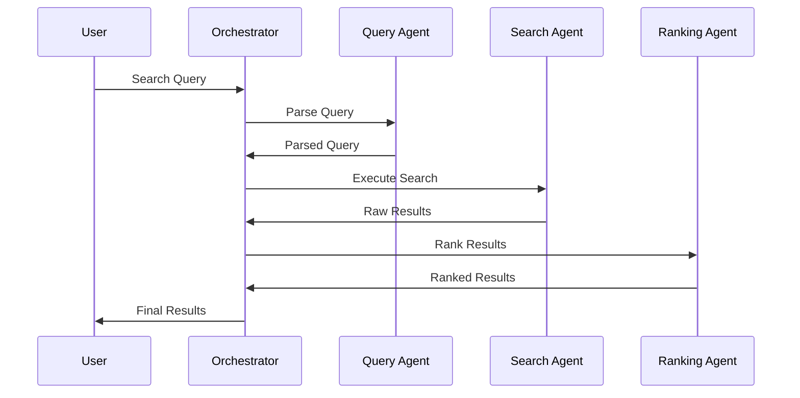

# AI Agent Architecture - GenSpark AI Search MVP

## 🤖 Agent Ecosystem Overview

This document details the complete AI agent architecture required to transform the GenSpark AI Search UI framework into a fully functional offline search system. Each agent has specific responsibilities and communicates through well-defined interfaces.

---

## 🏛️ **Architecture Principles**

### 1. **Microservices-Based Agents**
- Each agent is a self-contained service with specific responsibilities
- Agents communicate through standardized APIs and message queues
- Horizontal scaling and independent deployment capabilities

### 2. **Event-Driven Communication**
- Asynchronous message passing between agents
- Event sourcing for audit trails and debugging
- Resilient communication with retry mechanisms

### 3. **Local-First Design**
- All agents run locally without external dependencies
- Offline-capable with local model storage
- Privacy-preserving with zero data transmission

---

## 🎯 **Core Agent Specifications**

### 1. **Master Orchestrator Agent**

```typescript
interface MasterOrchestratorAgent {
  id: "orchestrator-agent"
  version: "1.0.0"
  
  responsibilities: [
    "Query routing and workflow management",
    "Agent health monitoring and recovery",
    "Resource allocation and load balancing",
    "Error handling and fallback strategies"
  ]
  
  apis: {
    route_query(query: SearchQuery): Promise<AgentWorkflow>
    monitor_agents(): Promise<AgentHealthStatus[]>
    handle_error(error: AgentError): Promise<ErrorResolution>
    get_system_status(): Promise<SystemStatus>
  }
  
  dependencies: ["message-queue", "sqlite-metadata", "agent-registry"]
  resources: {
    cpu: "low"
    memory: "512MB"
    storage: "100MB"
  }
}
```

**Implementation Details:**
```javascript
class MasterOrchestratorAgent {
  constructor() {
    this.agentRegistry = new Map()
    this.messageQueue = new EventEmitter()
    this.healthChecker = new AgentHealthChecker()
  }

  async routeQuery(query) {
    const workflow = this.createWorkflow(query)
    const agents = this.selectAgents(query.type)
    
    return await this.executeWorkflow(workflow, agents)
  }

  async executeWorkflow(workflow, agents) {
    const results = []
    for (const step of workflow.steps) {
      const agent = agents[step.agentType]
      const result = await agent.execute(step.task)
      results.push(result)
    }
    return this.combineResults(results)
  }
}
```

### 2. **File Processing Agent**

```typescript
interface FileProcessingAgent {
  id: "file-processing-agent"
  version: "1.0.0"
  
  responsibilities: [
    "File system scanning and monitoring",
    "Content extraction from multiple formats",
    "Metadata extraction and enrichment",
    "Change detection and incremental processing"
  ]
  
  apis: {
    scan_directory(path: string, options: ScanOptions): Promise<FileDiscovery[]>
    extract_content(file: FileItem): Promise<ExtractedContent>
    extract_metadata(file: FileItem): Promise<FileMetadata>
    watch_changes(paths: string[]): AsyncIterator<FileChangeEvent>
  }
  
  supported_formats: [
    "pdf", "docx", "txt", "md", "rtf",
    "jpg", "png", "gif", "svg", "webp",
    "mp4", "avi", "mov", "webm",
    "mp3", "wav", "flac",
    "js", "ts", "py", "java", "cpp", "go", "rust"
  ]
  
  dependencies: ["pdf-parse", "mammoth", "sharp", "ffmpeg", "tesseract"]
  resources: {
    cpu: "high"
    memory: "2GB"
    storage: "500MB"
  }
}
```

**Implementation Details:**
```python
class FileProcessingAgent:
    def __init__(self):
        self.extractors = {
            'pdf': PDFExtractor(),
            'docx': DocxExtractor(),
            'image': ImageExtractor(),
            'audio': AudioExtractor(),
            'video': VideoExtractor(),
            'code': CodeExtractor()
        }
        self.watcher = FileSystemWatcher()
    
    async def extract_content(self, file_item):
        extractor = self.get_extractor(file_item.extension)
        if not extractor:
            return TextContent(file_item.name, "")
        
        content = await extractor.extract(file_item.path)
        metadata = await self.extract_metadata(file_item)
        
        return ExtractedContent(
            content=content,
            metadata=metadata,
            chunks=self.chunk_content(content)
        )
    
    def chunk_content(self, content, chunk_size=1000, overlap=200):
        """Split content into overlapping chunks for better search"""
        chunks = []
        for i in range(0, len(content), chunk_size - overlap):
            chunk = content[i:i + chunk_size]
            chunks.append(chunk)
        return chunks
```

### 3. **Vector Embedding Agent**

```typescript
interface VectorEmbeddingAgent {
  id: "vector-embedding-agent"
  version: "1.0.0"
  
  responsibilities: [
    "Text embedding using transformer models",
    "Image embedding using vision models",
    "Code embedding using specialized models",
    "Batch processing and optimization"
  ]
  
  apis: {
    embed_text(text: string[], model?: string): Promise<Float32Array[]>
    embed_images(images: Buffer[], model?: string): Promise<Float32Array[]>
    embed_code(code: CodeSnippet[], model?: string): Promise<Float32Array[]>
    get_model_info(): Promise<ModelInfo[]>
  }
  
  models: {
    text: "sentence-transformers/all-MiniLM-L6-v2"
    image: "openai/clip-vit-base-patch32"
    code: "microsoft/codebert-base"
    multilingual: "sentence-transformers/paraphrase-multilingual-MiniLM-L12-v2"
  }
  
  dependencies: ["transformers-js", "onnxruntime", "tokenizers"]
  resources: {
    cpu: "high"
    memory: "4GB"
    storage: "2GB"
    gpu: "optional"
  }
}
```

**Implementation Details:**
```javascript
class VectorEmbeddingAgent {
  constructor() {
    this.models = new Map()
    this.batchProcessor = new BatchProcessor()
  }

  async initialize() {
    // Load models on startup
    this.textModel = await this.loadModel('text')
    this.imageModel = await this.loadModel('image')
    this.codeModel = await this.loadModel('code')
  }

  async embedText(texts, model = 'text') {
    const embeddings = []
    const batches = this.batchProcessor.createBatches(texts, 32)
    
    for (const batch of batches) {
      const batchEmbeddings = await this.models.get(model).encode(batch)
      embeddings.push(...batchEmbeddings)
    }
    
    return embeddings
  }

  async loadModel(modelType) {
    const modelPath = this.getModelPath(modelType)
    return await ort.InferenceSession.create(modelPath)
  }
}
```

### 4. **Query Understanding Agent**

```typescript
interface QueryUnderstandingAgent {
  id: "query-understanding-agent"
  version: "1.0.0"
  
  responsibilities: [
    "Natural language query parsing",
    "Intent classification and extraction",
    "Entity recognition and normalization",
    "Query expansion and suggestion"
  ]
  
  apis: {
    parse_query(query: string): Promise<ParsedQuery>
    classify_intent(query: string): Promise<IntentClassification>
    extract_entities(query: string): Promise<Entity[]>
    suggest_queries(partial: string): Promise<string[]>
    expand_query(query: string): Promise<ExpandedQuery>
  }
  
  capabilities: {
    languages: ["en", "es", "fr", "de", "zh"]
    intents: ["search", "filter", "sort", "navigate", "help"]
    entities: ["date", "person", "location", "filetype", "size"]
  }
  
  dependencies: ["spacy", "nltk", "dateparser", "fuzzywuzzy"]
  resources: {
    cpu: "medium"
    memory: "1GB"
    storage: "500MB"
  }
}
```

**Implementation Details:**
```javascript
class QueryUnderstandingAgent {
  constructor() {
    this.nlpPipeline = new NLPPipeline()
    this.intentClassifier = new IntentClassifier()
    this.entityExtractor = new EntityExtractor()
    this.queryExpander = new QueryExpander()
  }

  async parseQuery(query) {
    const intent = await this.classifyIntent(query)
    const entities = await this.extractEntities(query)
    const filters = this.extractFilters(query)
    const keywords = this.extractKeywords(query)
    
    return {
      originalQuery: query,
      intent: intent,
      entities: entities,
      filters: filters,
      keywords: keywords,
      queryVector: await this.embedQuery(query)
    }
  }

  async classifyIntent(query) {
    const features = this.extractIntentFeatures(query)
    return await this.intentClassifier.predict(features)
  }

  extractFilters(query) {
    const filters = {}
    
    // Date filters
    const dateMatch = query.match(/(?:from|after|since) (\d{4})/i)
    if (dateMatch) filters.dateAfter = new Date(dateMatch[1])
    
    // File type filters  
    const typeMatch = query.match(/\.(pdf|docx?|txt|jpg|png)/i)
    if (typeMatch) filters.fileType = typeMatch[1]
    
    // Size filters
    const sizeMatch = query.match(/(small|large|big)/i)
    if (sizeMatch) filters.size = this.mapSizeFilter(sizeMatch[1])
    
    return filters
  }
}
```

### 5. **Search Agent**

```typescript
interface SearchAgent {
  id: "search-agent"
  version: "1.0.0"
  
  responsibilities: [
    "Vector similarity search execution",
    "Hybrid text and semantic search",
    "Multi-modal search coordination",
    "Result filtering and pagination"
  ]
  
  apis: {
    vector_search(queryVector: Float32Array, options: SearchOptions): Promise<SearchResult[]>
    text_search(query: string, options: SearchOptions): Promise<SearchResult[]>
    hybrid_search(parsedQuery: ParsedQuery): Promise<SearchResult[]>
    multimodal_search(query: MultiModalQuery): Promise<SearchResult[]>
  }
  
  search_types: {
    vector: "Semantic similarity search using embeddings"
    text: "Traditional keyword-based search"
    hybrid: "Combined vector and text search"
    multimodal: "Search across text, images, and code"
  }
  
  dependencies: ["chroma-db", "sqlite-fts", "faiss"]
  resources: {
    cpu: "high"
    memory: "2GB"
    storage: "varies"
  }
}
```

**Implementation Details:**
```javascript
class SearchAgent {
  constructor() {
    this.vectorDB = new ChromaDB()
    this.textDB = new SQLiteFTS()
    this.resultMerger = new ResultMerger()
  }

  async hybridSearch(parsedQuery) {
    const vectorResults = await this.vectorSearch(parsedQuery.queryVector, {
      topK: 50,
      filters: parsedQuery.filters
    })
    
    const textResults = await this.textSearch(parsedQuery.keywords.join(' '), {
      topK: 50,
      filters: parsedQuery.filters
    })
    
    // Merge and re-rank results
    const mergedResults = this.resultMerger.merge(vectorResults, textResults)
    return this.applyFinalFilters(mergedResults, parsedQuery.filters)
  }

  async vectorSearch(queryVector, options) {
    return await this.vectorDB.query({
      query_embeddings: [queryVector],
      n_results: options.topK,
      where: this.buildWhereClause(options.filters)
    })
  }

  async textSearch(query, options) {
    const sql = `
      SELECT * FROM documents 
      WHERE content MATCH ? 
      ${this.buildFilterSQL(options.filters)}
      ORDER BY bm25(content) 
      LIMIT ?
    `
    return await this.textDB.query(sql, [query, options.topK])
  }
}
```

### 6. **Result Ranking Agent**

```typescript
interface ResultRankingAgent {
  id: "result-ranking-agent"
  version: "1.0.0"
  
  responsibilities: [
    "Relevance scoring and re-ranking",
    "Context-aware result organization",
    "Personalization based on user behavior",
    "Confidence scoring and explanation"
  ]
  
  apis: {
    rank_results(results: SearchResult[], query: ParsedQuery): Promise<RankedResult[]>
    explain_ranking(result: SearchResult, query: ParsedQuery): Promise<RankingExplanation>
    personalize_results(results: SearchResult[], userId: string): Promise<SearchResult[]>
    calculate_confidence(result: SearchResult, query: ParsedQuery): Promise<number>
  }
  
  ranking_factors: {
    semantic_similarity: 0.4
    keyword_match: 0.3
    recency: 0.1
    user_preference: 0.1
    file_popularity: 0.1
  }
  
  dependencies: ["ml-models", "user-analytics", "sqlite"]
  resources: {
    cpu: "medium"
    memory: "1GB"
    storage: "200MB"
  }
}
```

### 7. **Learning Agent**

```typescript
interface LearningAgent {
  id: "learning-agent"
  version: "1.0.0"
  
  responsibilities: [
    "User interaction analysis",
    "Query-result relevance learning",
    "Personalization model updates",
    "Performance optimization suggestions"
  ]
  
  apis: {
    record_interaction(interaction: UserInteraction): Promise<void>
    analyze_patterns(): Promise<UserPatterns>
    update_personalization(userId: string): Promise<PersonalizationUpdate>
    suggest_optimizations(): Promise<OptimizationSuggestion[]>
  }
  
  learning_types: {
    click_through: "Learn from clicked results"
    dwell_time: "Analyze time spent on results"
    query_refinement: "Track query evolution patterns"
    feedback: "Explicit user feedback integration"
  }
  
  dependencies: ["analytics-db", "ml-pipeline", "user-profiles"]
  resources: {
    cpu: "low"
    memory: "512MB"
    storage: "1GB"
  }
}
```

---

## 🔄 **Inter-Agent Communication**

### Message Bus Architecture
```typescript
interface AgentMessage {
  id: string
  type: 'query' | 'response' | 'notification' | 'error'
  source: string
  target: string
  payload: any
  timestamp: number
  priority: 'low' | 'medium' | 'high'
}

interface MessageBus {
  publish(topic: string, message: AgentMessage): Promise<void>
  subscribe(topic: string, handler: MessageHandler): void
  request(target: string, message: AgentMessage): Promise<AgentMessage>
  broadcast(message: AgentMessage): Promise<void>
}
```

### Event Flow Example


---

## 📊 **Performance & Monitoring**

### Agent Health Checks
```typescript
interface AgentHealth {
  agentId: string
  status: 'healthy' | 'degraded' | 'failed'
  responseTime: number
  memoryUsage: number
  cpuUsage: number
  errorRate: number
  lastHeartbeat: number
}
```

### Performance Metrics
- **Query Processing Time**: <500ms end-to-end
- **Agent Communication Latency**: <50ms average
- **Memory Per Agent**: As specified in resources
- **Error Rate**: <1% across all agents
- **Uptime**: 99.9% availability

This architecture provides a robust, scalable foundation for the GenSpark AI Search MVP, with clear separation of concerns and well-defined interfaces between components.